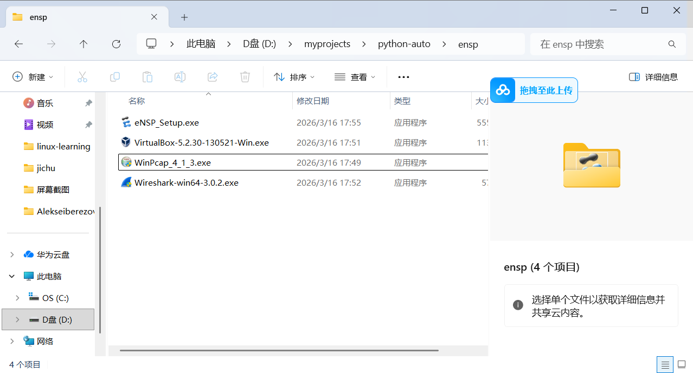

---

---

# 本文来讲讲如何安装ensp

ensp是华为官方推出的一款模拟器适用模拟企业网络环境。主要的安装包已经打包放在本项目的ensp文件夹下。废话不多说，我们来讲讲怎么安装。（本文安装教程参考华为云官方文档）

下载完后的所需文件如下：

我们先安装winpcap

如若显示冲突，可能是本地早有安装最新版本，需找到相对应文件，更改拓展名

C:\Windows\SysWOW64 的wpcap.dll改成 wpcap.dll.old

C:\Windows\SysWOW64的packet.dll改成 packet.dll.old

接下来是wireshark，这玩意需要依托winpcap

再接下来是virtualbox，注意这玩意是虚拟机，环境可能报错，所以一定要关闭杀毒软件

最后一个是ensp，今天的重头戏，以上所有安装一定都要在**英文路径**中

初次安装完ensp一定要进行一些配置，进入系统和安全>Windows Defender防火墙（允许应用通过Windows防火墙）

ensp和ensp_vboxserver两个都要放行，专有和公共都要放行

至此结束

ensp结束了，python自动化开始了